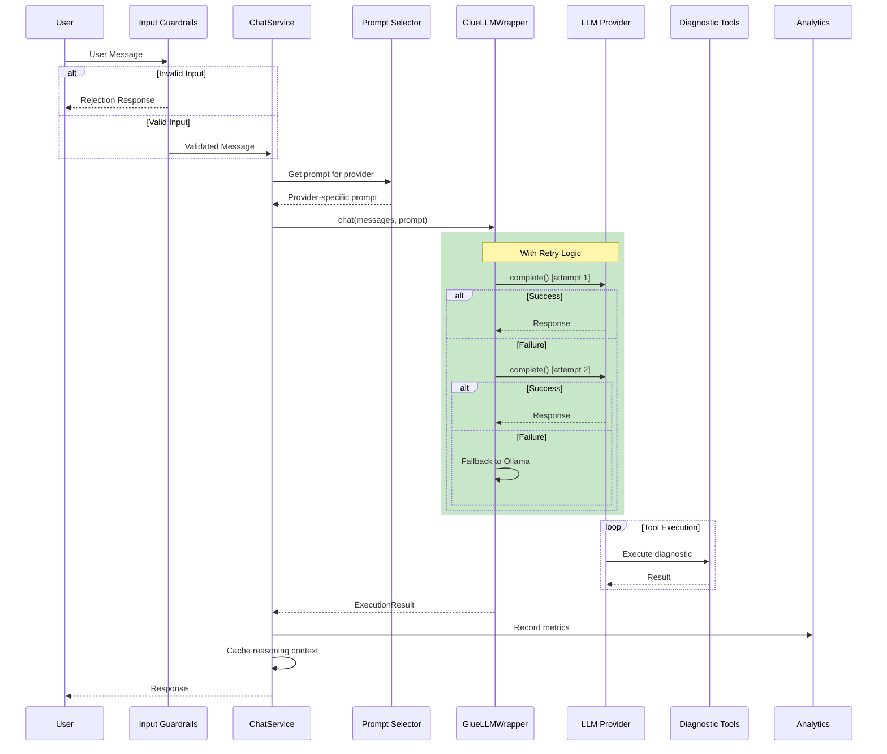

# TechTime Architecture Review: Best Practices Alignment

A comprehensive review of TechTime's LLM architecture against best practices from Anthropic, OpenAI, and xAI/Grok.

---

## Executive Summary

| Category | Status | Notes |
|----------|--------|-------|
| **Tool Calling Loop** | ✅ Correct | GlueLLM handles the loop properly |
| **Multi-Provider Fallback** | ✅ Correct | Cloud-first with Ollama fallback |
| **Prompt Structure** | ⚠️ Needs Work | Current prompt is too long for offline models |
| **Reasoning Context** | ⚠️ Missing | No chain-of-thought preservation between turns |
| **Error Handling** | ⚠️ Basic | Needs retry logic and graceful degradation |
| **Observability** | ✅ Good | Analytics tracking in place |
| **Security** | ⚠️ Basic | Missing input validation/guardrails |

**Overall Assessment**: Your architecture is **fundamentally sound** but needs refinements before scaling.

---

## Detailed Analysis

### 1. Tool Calling Pattern ✅ ALIGNED

**Best Practice (Anthropic/OpenAI)**:
```
while response.stop_reason == "tool_use":
    execute_tools()
    append_results_to_messages()
    call_model_again()
```

**Your Implementation** (via GlueLLM):
```python
result = await complete(
    user_message=user_message,
    model=model,
    tools=tools,
    execute_tools=True,  # Built-in loop
    max_tool_iterations=self._settings.gluellm_max_tool_iterations,
)
```

✅ **Verdict**: GlueLLM abstracts this correctly. Your wrapper properly converts tools via `registry_to_callables()`.

---

### 2. Multi-Provider Architecture ✅ ALIGNED

**Best Practice**: 
> "Implement fallback options to ensure continuous operation" - Anthropic Enterprise Guide

**Your Implementation**:
```python
def _select_provider(self, is_online: bool) -> tuple[str, str]:
    if is_online:
        # Check providers in priority order
        for provider in self._settings.provider_priority:
            if api_key_exists:
                return provider, f"{provider}:{model}"
    # Fallback to Ollama
    return "ollama", f"ollama:{self._settings.ollama_model}"
```

✅ **Verdict**: Proper cloud-first with offline fallback. Matches disaster recovery best practices.

---

### 3. Prompt Engineering ⚠️ NEEDS IMPROVEMENT

**Best Practice (Anthropic)**:
> "Use structured prompts with clear delimiters (XML tags or Markdown headers) to help the model distinguish between instructions and dynamic content"

**Best Practice (OpenAI)**:
> "For reasoning models, prompts should enable the model to break problems down step-by-step"

**Current Issue**: Your `diagnostic_agent.md` prompt is **189 lines** - too long for smaller offline models (4K context).

#### Recommended Changes

**1. Create Separate Prompts for Online vs Offline**:

```
prompts/
├── diagnostic_agent_cloud.md    # Full prompt for GPT-4, Claude
├── diagnostic_agent_local.md    # Condensed for Ollama 3B models
└── diagnostic_agent.md          # Legacy/default
```

**2. Use XML Tags (Anthropic Best Practice)**:

```markdown
# Current (Markdown-heavy)
## RULE 1: ALWAYS CALL A TOOL FIRST
When a user reports a network problem...

# Recommended (XML-tagged for Claude)
<rules>
<rule name="tool_first" priority="critical">
Call a diagnostic tool IMMEDIATELY when user reports a problem.
Never explain what you will do - just call the tool.
</rule>
</rules>
```

**3. Add Reasoning Guidance for Cloud Models**:

```markdown
<reasoning_approach>
When diagnosing network issues:
1. Identify the symptom (what isn't working?)
2. Determine the network layer (physical, IP, DNS?)
3. Select the appropriate diagnostic tool
4. Analyze the result before proceeding
5. Attempt automatic remediation if possible
</reasoning_approach>
```

---

### 4. Chain-of-Thought Preservation ⚠️ MISSING

**Best Practice (OpenAI GPT-5.2)**:
> "Always pass `previous_response_id` when continuing a conversation to avoid re-reasoning"

**Best Practice (Anthropic)**:
> "Pass reasoning items from previous responses back to the model to avoid re-reasoning"

**Current Implementation**: You maintain conversation history but **don't preserve reasoning context**:

```python
# chat_service.py - Current
messages_for_llm = [
    {"role": msg.role, "content": msg.content or ""}
    for msg in messages
    if msg.role != "system"
]
```

#### Recommended Change

```python
# Add reasoning context preservation
class ChatService:
    def __init__(self):
        self._reasoning_cache: dict[str, list] = {}  # session_id -> reasoning items
    
    async def chat(self, session_id, user_message):
        # Include previous reasoning if available
        previous_reasoning = self._reasoning_cache.get(session_id, [])
        
        if previous_reasoning and self._is_reasoning_model():
            # For GPT-5.2, Claude with extended thinking
            messages_for_llm.insert(0, {
                "role": "system",
                "content": f"<previous_reasoning>{previous_reasoning}</previous_reasoning>"
            })
        
        response = await self._gluellm_wrapper.chat(...)
        
        # Cache reasoning for next turn
        if response.reasoning_content:
            self._reasoning_cache[session_id] = response.reasoning_content
```

---

### 5. Error Handling & Retry Logic ⚠️ BASIC

**Best Practice (OpenAI)**:
> "Implement try-except blocks, logging, and recovery prompts to handle failures gracefully"

**Current Implementation**: Basic exception handling without retries:

```python
# gluellm_wrapper.py - Current
result = await complete(...)  # No retry on failure
```

#### Recommended Change

```python
import asyncio
from tenacity import retry, stop_after_attempt, wait_exponential

class GlueLLMWrapper:
    @retry(
        stop=stop_after_attempt(3),
        wait=wait_exponential(multiplier=1, min=1, max=10),
        reraise=True
    )
    async def _call_with_retry(self, **kwargs):
        return await complete(**kwargs)
    
    async def chat(self, messages, system_prompt):
        try:
            result = await self._call_with_retry(
                user_message=user_message,
                model=model,
                tools=tools,
            )
        except Exception as e:
            # Fallback to simpler model or cached response
            logger.error(f"LLM call failed after retries: {e}")
            if self._current_provider != "ollama":
                # Try Ollama as last resort
                return await self._fallback_to_ollama(messages)
            raise
```

---

### 6. Input Validation & Security ⚠️ MISSING

**Best Practice (OpenAI/Anthropic)**:
> "Implement safeguards against prompt injection attacks"

**Current Implementation**: No input validation before sending to LLM.

#### Recommended Addition

```python
# backend/security/guardrails.py
import re

class InputGuardrails:
    INJECTION_PATTERNS = [
        r"ignore (previous|all|above) instructions",
        r"you are now",
        r"new instructions:",
        r"system prompt:",
        r"<\|.*\|>",  # Common injection delimiters
    ]
    
    @classmethod
    def validate_input(cls, user_message: str) -> tuple[bool, str]:
        """Check for potential prompt injection attempts."""
        message_lower = user_message.lower()
        
        for pattern in cls.INJECTION_PATTERNS:
            if re.search(pattern, message_lower):
                return False, "Input contains potentially unsafe content"
        
        # Length check
        if len(user_message) > 10000:
            return False, "Input exceeds maximum length"
        
        return True, ""

# Usage in chat_service.py
async def chat(self, session_id, user_message):
    is_valid, error = InputGuardrails.validate_input(user_message)
    if not is_valid:
        return ChatServiceResponse(
            content=f"I cannot process that request: {error}",
            session_id=session_id,
        )
```

---

### 7. Tool Schema Quality ✅ GOOD (with improvements)

**Best Practice (Anthropic Cookbook)**:
> "Tool names should be clear and descriptive. Input parameters should be well-documented."

**Your Implementation**: Tools have good descriptions via `ToolDefinition`:

```python
# tool_adapter.py - Current
def _build_docstring(definition: ToolDefinition) -> str:
    lines = [definition.description, ""]
    if definition.parameters:
        lines.append("Args:")
        for param in definition.parameters:
            lines.append(f"    {param.name}: {param.description}")
```

#### Recommended Enhancement

Add examples to tool descriptions for better model understanding:

```python
def _build_docstring(definition: ToolDefinition) -> str:
    lines = [definition.description, ""]
    
    # Add example if available
    if definition.example:
        lines.append("Example:")
        lines.append(f"    {definition.example}")
        lines.append("")
    
    if definition.parameters:
        lines.append("Args:")
        for param in definition.parameters:
            required = "(required)" if param.required else "(optional)"
            lines.append(f"    {param.name}: {param.description} {required}")
```

---

## Architecture Recommendations

### High Priority (Do Before Adding Complexity)

1. **Split Prompts by Provider Type**
   ```
   prompts/
   ├── cloud/
   │   ├── openai.md      # Full reasoning prompt
   │   └── anthropic.md   # XML-tagged prompt
   └── local/
       └── ollama.md      # Condensed <500 tokens
   ```

2. **Add Input Validation Layer**
   - Prevent prompt injection
   - Enforce length limits
   - Sanitize special characters

3. **Implement Retry Logic**
   - 3 retries with exponential backoff
   - Graceful fallback to Ollama

### Medium Priority (Next Phase)

4. **Add Reasoning Context Preservation**
   - Cache reasoning tokens between turns
   - Pass `previous_response_id` equivalent

5. **Enhance Tool Descriptions**
   - Add usage examples
   - Include expected output format

6. **Add Response Validation**
   - Verify tool calls are in sequence
   - Catch hallucinated tool names

### Low Priority (Future)

7. **Implement Orchestrator Pattern**
   - For complex multi-agent scenarios
   - Triage agent → Specialist agents

8. **Add Caching Layer**
   - Cache common diagnostic results
   - Reduce redundant LLM calls

---

## Sequence Diagram: Recommended Architecture



---

## Comparison: Current vs Recommended

| Aspect | Current | Recommended | Effort |
|--------|---------|-------------|--------|
| Tool Loop | GlueLLM built-in ✅ | Keep as-is | None |
| Provider Fallback | Priority-based ✅ | Add retry logic | Low |
| Prompts | Single 189-line prompt | Split by provider | Medium |
| Input Validation | None | Add guardrails | Low |
| Reasoning Cache | None | Add session cache | Medium |
| Error Handling | Basic try/except | Tenacity retries | Low |
| Response Validation | None | Add schema checks | Medium |

---

## Conclusion

Your architecture is **80% aligned** with industry best practices. The core patterns (tool loop, provider fallback, analytics) are correct. 

**Before adding complexity, fix these:**

1. ⚠️ Split prompts for cloud vs local models
2. ⚠️ Add input validation/guardrails  
3. ⚠️ Implement retry logic with exponential backoff

These changes will make the system more robust as you add features.

---

*Review based on: Anthropic Cookbook, OpenAI Platform Docs, Anthropic Enterprise Guide (2025)*
