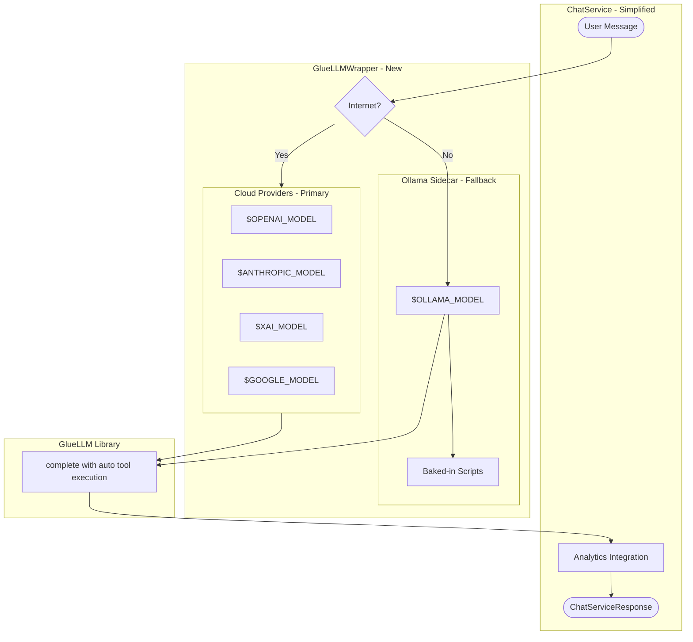

# Phase 8: GlueLLM Hybrid Integration - Implementation Complete

## Summary

This phase replaced the existing LLM layer with GlueLLM, providing a unified interface to multiple cloud providers (OpenAI, Anthropic, xAI, Google) with automatic fallback to the Ollama sidecar when offline.

## Architecture



## Changes Made

### 8.1 Dependencies Updated

**Files Modified:**
- `pyproject.toml` - Added GlueLLM, updated Python requirement to 3.12
- `environment.yml` - Updated to Python 3.12, added GlueLLM from GitHub

```toml
# pyproject.toml
requires-python = ">=3.12"
dependencies = [
    # ... existing deps ...
    "gluellm @ git+https://github.com/Bioto/glue-llm.git",
]
```

### 8.2 Configuration Updated

**File Modified:** `backend/config.py`

Added cloud provider settings:
- `provider_priority` - Order to check providers
- `openai_api_key`, `openai_model`
- `anthropic_api_key`, `anthropic_model`
- `xai_api_key`, `xai_model`
- `google_api_key`, `google_model`
- `connectivity_check_url`, `connectivity_timeout_ms`
- `gluellm_max_tool_iterations`

### 8.3 Tool Adapter Created

**File Created:** `backend/llm/tool_adapter.py`

Converts ToolRegistry tools to GlueLLM-compatible callables:
- `registry_to_callables()` - Main conversion function
- `_wrap_tool()` - Wraps individual tools with timing
- `_build_docstring()` - Generates docstrings for schema generation

### 8.4 Result Adapter Created

**File Created:** `backend/llm/result_adapter.py`

Converts GlueLLM ExecutionResult to ChatServiceResponse:
- `to_chat_service_response()` - Main conversion function
- `extract_diagnostics()` - Extracts metadata and confidence
- `calculate_confidence()` - Calculates confidence from tool history
- `extract_token_usage()` - Standardizes token usage format

### 8.5 GlueLLM Wrapper Created

**File Created:** `backend/llm/gluellm_wrapper.py`

Main integration class:
- Cloud-first provider selection
- Automatic connectivity checking
- Ollama fallback when offline
- Analytics integration
- Tool timing callbacks

### 8.6 ChatService Simplified

**File Modified:** `backend/chat_service.py`

Changes:
- Replaced `LLMRouter` with `GlueLLMWrapper`
- Removed manual tool execution loop (~120 lines)
- Simplified `chat()` method from ~180 lines to ~80 lines
- Tool execution now handled by GlueLLM internally

### 8.7 LLM Module Exports Updated

**File Modified:** `backend/llm/__init__.py`

- Added GlueLLMWrapper and adapter exports
- Marked old clients as deprecated in docstring

### 8.8 Deprecation Warnings Added

**Files Modified:**
- `backend/llm/ollama_client.py`
- `backend/llm/openai_client.py`
- `backend/llm/router.py`

Added deprecation warnings at module level.

### 8.9 Environment Template Updated

**File Modified:** `env.example`

Added all new environment variables for:
- Provider priority configuration
- Cloud provider API keys and models
- Connectivity detection settings
- GlueLLM settings

### 8.10 Tests Created

**File Created:** `backend/tests/test_gluellm_wrapper.py`

21 tests covering:
- Provider selection logic (4 tests)
- Connectivity checking (2 tests)
- Tool adapter functionality (4 tests)
- Result adapter functionality (7 tests)
- Integration tests (4 tests)

## Files Summary

| File | Action | Description |
|------|--------|-------------|
| `pyproject.toml` | Modified | Added gluellm, Python 3.12 |
| `environment.yml` | Modified | Updated to Python 3.12 |
| `backend/config.py` | Modified | Added cloud provider settings |
| `backend/llm/tool_adapter.py` | Created | ToolRegistry to Callable conversion |
| `backend/llm/result_adapter.py` | Created | ExecutionResult to ChatServiceResponse |
| `backend/llm/gluellm_wrapper.py` | Created | Main GlueLLM integration |
| `backend/llm/__init__.py` | Modified | Updated exports |
| `backend/chat_service.py` | Modified | Simplified to use wrapper |
| `backend/llm/ollama_client.py` | Modified | Added deprecation warning |
| `backend/llm/openai_client.py` | Modified | Added deprecation warning |
| `backend/llm/router.py` | Modified | Added deprecation warning |
| `env.example` | Modified | Added new env vars |
| `backend/tests/test_gluellm_wrapper.py` | Created | Unit tests (21 tests) |

## Verification Results

All 21 tests pass:

```
$ python -m pytest backend/tests/test_gluellm_wrapper.py -v
============================== 21 passed in 0.50s ==============================
```

## Key Benefits

1. **Unified Interface**: Single wrapper handles all LLM providers
2. **Automatic Tool Execution**: GlueLLM handles the tool loop internally
3. **Simplified ChatService**: Reduced from ~180 lines to ~80 lines
4. **Cloud-First Architecture**: Primary cloud providers with Ollama fallback
5. **All Configurable**: Provider priority and models via environment variables
6. **Preserved Analytics**: Tool timing and token usage tracking maintained
7. **Rollback Ready**: Old clients kept with deprecation warnings

## Rollback Strategy

If issues arise:
1. Revert `chat_service.py` to use `LLMRouter`
2. Remove deprecation warnings from old clients
3. Update `backend/llm/__init__.py` to remove new exports
4. Old clients remain fully functional

## Next Steps (Phase 9)

1. Delete deprecated clients after validation period
2. Add streaming support through GlueLLM
3. Implement cost tracking with `estimated_cost_usd`
4. Add provider health monitoring
