# Reasoning Models API Flow: AnyLLM/GlueLLM Sequence Diagrams

This document explains how reasoning models work when calling APIs through AnyLLM and GlueLLM, with specific focus on the differences between **online (cloud)** and **offline (local)** models. Use this to guide prompt creation for each mode.

---

## Table of Contents

1. [High-Level Overview](#high-level-overview)
2. [Online vs Offline Model Comparison](#online-vs-offline-model-comparison)
3. [Detailed Sequence Diagrams](#detailed-sequence-diagrams)
4. [Reasoning Model Internal Flow](#reasoning-model-internal-flow)
5. [Tool Calling Patterns](#tool-calling-patterns)
6. [Prompt Design Guidelines](#prompt-design-guidelines)

---

## High-Level Overview

### What is a Reasoning Model?

Reasoning models (like OpenAI o1/o3, Claude with extended thinking, DeepSeek R1) generate **internal chains of thought** before producing a final response. They return:

1. **Reasoning Content** - Internal thought process (may be hidden or visible)
2. **Final Response** - The actual answer to the user
3. **Tool Calls** - Functions to execute for gathering information

### AnyLLM vs GlueLLM

| Library | Purpose | Key Feature |
|---------|---------|-------------|
| **AnyLLM** | Unified interface to multiple LLM providers | Consistent API across OpenAI, Anthropic, Google, etc. |
| **GlueLLM** | Tool execution automation | Built-in tool loop with `execute_tools=True` |

Your TechTime app uses **GlueLLM** with a wrapper (`GlueLLMWrapper`) that handles:
- Provider selection based on connectivity
- Tool conversion from `ToolRegistry` to callables
- Analytics integration

---

## Online vs Offline Model Comparison

```mermaid
flowchart LR
    subgraph Online ["☁️ Online Mode (Cloud)"]
        direction TB
        O1[Large reasoning models]
        O2[Extended context windows]
        O3[Complex multi-step reasoning]
        O4[Real-time knowledge]
        O5[Higher latency ~2-10s]
        O6[Cost per token]
    end
    
    subgraph Offline ["💻 Offline Mode (Local)"]
        direction TB
        L1[Smaller models 3B-7B]
        L2[Limited context ~4K tokens]
        L3[Simpler reasoning chains]
        L4[Baked-in knowledge only]
        L5[Lower latency ~0.5-2s]
        L6[No API cost]
    end
    
    User([User Query]) --> Decision{Internet?}
    Decision -->|Yes| Online
    Decision -->|No| Offline
```



### Key Differences for Prompt Design

| Aspect | Online (Cloud) | Offline (Ollama) |
|--------|----------------|------------------|
| **Reasoning Depth** | Can handle complex multi-step logic | Keep reasoning simple and direct |
| **Context Length** | 128K+ tokens available | ~4K tokens, be concise |
| **Tool Calling** | Sophisticated tool selection | May need explicit tool hints |
| **Error Recovery** | Can reason about failures | Needs explicit fallback rules |
| **Response Style** | Can be verbose and detailed | Should be terse and actionable |
| **Prompt Length** | Can handle long system prompts | Keep prompts under 500 tokens |

---

## Detailed Sequence Diagrams

### 1. Online Mode: Cloud Reasoning Model Flow

```mermaid
sequenceDiagram
    autonumber
    participant User as 👤 User
    participant App as 🖥️ ChatService
    participant Wrapper as 🔧 GlueLLMWrapper
    participant Net as 🌐 Connectivity Check
    participant Provider as ☁️ Cloud Provider<br/>(OpenAI/Anthropic/etc)
    participant Reasoning as 🧠 Reasoning Engine
    participant Tools as ⚙️ Diagnostic Tools

    Note over User,Tools: ONLINE MODE - Full Reasoning Capabilities

    User->>App: "My WiFi isn't working"
    App->>Wrapper: chat(messages, system_prompt)
    
    rect rgb(200, 230, 200)
        Note over Wrapper,Net: Step 1: Provider Selection
        Wrapper->>Net: GET connectivity_check_url
        Net-->>Wrapper: 200 OK (online)
        Wrapper->>Wrapper: Check API keys in priority order
        Note over Wrapper: OPENAI_API_KEY ✓ → Use OpenAI
    end
    
    rect rgb(200, 200, 240)
        Note over Wrapper,Reasoning: Step 2: Initial LLM Call
        Wrapper->>Provider: complete(model, prompt, tools)
        Provider->>Reasoning: Process with extended thinking
        
        Note over Reasoning: 🤔 Internal Reasoning Chain:<br/>1. User reports WiFi issue<br/>2. Need to check adapter status first<br/>3. Will call check_adapter_status tool
        
        Reasoning-->>Provider: {tool_calls: [check_adapter_status]}
    end
    
    rect rgb(240, 220, 200)
        Note over Provider,Tools: Step 3: Tool Execution Loop
        Provider->>Tools: check_adapter_status()
        Tools-->>Provider: {connected: false, wifi_enabled: true}
        
        Note over Reasoning: 🤔 Reasoning continues:<br/>1. Adapter not connected<br/>2. WiFi is enabled but not joined<br/>3. Try enable_wifi to reconnect
        
        Provider->>Tools: enable_wifi()
        Tools-->>Provider: {success: true, network: "HomeWiFi"}
        
        Provider->>Tools: check_adapter_status()
        Tools-->>Provider: {connected: true, wifi_enabled: true}
    end
    
    rect rgb(220, 240, 220)
        Note over Provider,Wrapper: Step 4: Final Response Generation
        Note over Reasoning: 🤔 Final reasoning:<br/>1. WiFi was disconnected<br/>2. Successfully reconnected<br/>3. Provide clear summary
        
        Reasoning-->>Provider: final_response + tool_history
        Provider-->>Wrapper: ExecutionResult
    end
    
    Wrapper-->>App: ChatServiceResponse
    App-->>User: "I found your WiFi was disconnected..."
```



### 2. Offline Mode: Local Ollama Flow

```mermaid
sequenceDiagram
    autonumber
    participant User as 👤 User
    participant App as 🖥️ ChatService
    participant Wrapper as 🔧 GlueLLMWrapper
    participant Net as 🌐 Connectivity Check
    participant Ollama as 🦙 Ollama Sidecar<br/>(Always Running)
    participant Tools as ⚙️ Diagnostic Tools

    Note over User,Tools: OFFLINE MODE - Simplified Reasoning

    User->>App: "My WiFi isn't working"
    App->>Wrapper: chat(messages, system_prompt)
    
    rect rgb(255, 220, 220)
        Note over Wrapper,Net: Step 1: Provider Selection
        Wrapper->>Net: GET connectivity_check_url
        Net-->>Wrapper: ❌ Timeout/Error (offline)
        Note over Wrapper: Fallback to Ollama<br/>Model: $OLLAMA_MODEL
    end
    
    rect rgb(200, 200, 240)
        Note over Wrapper,Ollama: Step 2: Initial LLM Call
        Wrapper->>Ollama: complete(model, prompt, tools)
        
        Note over Ollama: 🧠 Simpler reasoning:<br/>WiFi issue → check_adapter_status
        
        Ollama-->>Wrapper: {tool_calls: [check_adapter_status]}
    end
    
    rect rgb(240, 220, 200)
        Note over Ollama,Tools: Step 3: Tool Execution
        Wrapper->>Tools: check_adapter_status()
        Tools-->>Wrapper: {connected: false}
        
        Wrapper->>Ollama: Tool result: not connected
        
        Note over Ollama: 🧠 Simple logic:<br/>Not connected → enable_wifi
        
        Ollama-->>Wrapper: {tool_calls: [enable_wifi]}
        Wrapper->>Tools: enable_wifi()
        Tools-->>Wrapper: {success: true}
    end
    
    rect rgb(220, 240, 220)
        Note over Ollama,Wrapper: Step 4: Final Response
        Wrapper->>Ollama: All tool results
        Ollama-->>Wrapper: Brief response
    end
    
    Wrapper-->>App: ChatServiceResponse
    App-->>User: "WiFi reconnected. Issue resolved."
```



---

## Reasoning Model Internal Flow

### How Reasoning Models Process Tool Calls


### Extended Thinking vs Standard Reasoning


---

## Tool Calling Patterns

### GlueLLM Tool Execution Loop


### Tool Schema Generation


---

## Prompt Design Guidelines

### Online Model Prompts (Cloud)

```markdown
# System Prompt for Cloud Reasoning Models

You are an expert IT support assistant with access to diagnostic tools.

## Reasoning Approach
1. Analyze the user's problem systematically
2. Consider multiple potential causes
3. Use tools to gather evidence before concluding
4. Explain your reasoning process to the user

## Tool Usage
- Always start with check_adapter_status for network issues
- Follow the diagnostic sequence: adapter → IP → gateway → DNS
- If a step fails, attempt automatic remediation before stopping

## Response Format
Provide detailed explanations including:
- What you found
- Why this is the likely cause
- Step-by-step fix instructions
- Verification steps

## Error Handling
If diagnostics pass but user reports issues:
1. Ask clarifying questions
2. Consider application-specific problems
3. Suggest advanced diagnostics
```

### Offline Model Prompts (Ollama)

```markdown
# System Prompt for Local Models (Ollama)

You diagnose IT problems using tools. Be direct and concise.

## Rules
1. ALWAYS call a tool first - don't explain what you'll do
2. Follow this sequence: adapter → IP → gateway → DNS
3. Stop at first failure, attempt fix, verify

## Tool Selection
| User Says | Call This |
|-----------|-----------|
| "no internet" | check_adapter_status |
| "wifi not working" | enable_wifi |
| "slow internet" | ping_gateway |

## Response Format
**Finding**: [What tool found]
**Fix**: [1-3 steps max]

## Keep responses under 100 words.
```

### Comparison Table for Prompt Design

| Element | Online Prompt | Offline Prompt |
|---------|--------------|----------------|
| **Length** | 500-2000 tokens | <500 tokens |
| **Instructions** | Detailed with examples | Terse with tables |
| **Reasoning guidance** | "Explain your thinking" | "Be direct, no explanation" |
| **Tool hints** | General principles | Explicit mapping tables |
| **Response format** | Flexible, detailed | Strict, brief |
| **Error handling** | Complex branching | Simple if/then rules |
| **Examples** | Multiple scenarios | Minimal or none |

---

## TechTime-Specific Architecture

### Current Implementation Flow


---

## Summary: Creating Effective Prompts

### For Online Models (Cloud APIs)
✅ **DO:**
- Provide rich context and examples
- Encourage step-by-step reasoning
- Allow for nuanced responses
- Include error recovery strategies

❌ **DON'T:**
- Worry about token limits (within reason)
- Over-constrain the response format
- Skip edge case handling

### For Offline Models (Ollama)
✅ **DO:**
- Keep prompts short and direct
- Use tables for quick reference
- Provide explicit tool mappings
- Enforce strict response formats

❌ **DON'T:**
- Include lengthy examples
- Expect complex reasoning chains
- Use ambiguous instructions
- Request verbose explanations

---

---

## API Response Structure Comparison

### Cloud Provider Response (OpenAI/Anthropic)


### Ollama Response (Local)


### GlueLLM ExecutionResult Structure

```python
@dataclass
class ExecutionResult:
    """What GlueLLM returns after complete()"""
    
    # The final text response from the model
    final_response: str | None
    
    # Model identifier used (e.g., "openai:gpt-4o")
    model: str
    
    # Number of tool calls made across all iterations
    tool_calls_made: int
    
    # History of all tool executions
    tool_execution_history: list[dict]
    # Each dict contains:
    #   - tool_name: str
    #   - arguments: dict
    #   - result: str
    #   - error: bool (optional)
    
    # Token usage statistics
    tokens_used: dict | None
    # Contains:
    #   - prompt: int
    #   - completion: int
    #   - total: int
    
    # Estimated cost (cloud providers only)
    estimated_cost_usd: float | None
```

---

## Prompt Templates by Provider

### OpenAI (gpt-4o, o1, o3)

```markdown
# TechTime Diagnostic Agent

You are an expert IT support assistant. Use systematic reasoning to diagnose network issues.

## Available Tools
- check_adapter_status: Check if network adapter is connected
- get_ip_config: Get IP address and network configuration
- ping_gateway: Test router connectivity
- ping_dns: Test internet connectivity
- test_dns_resolution: Verify DNS is working
- enable_wifi: Enable and connect WiFi

## Diagnostic Approach
Think through each problem step-by-step:
1. What symptoms is the user reporting?
2. What layer of the network stack is likely affected?
3. Which diagnostic tool will provide the most useful information?
4. Based on results, what's the root cause?
5. What remediation steps should be taken?

## Response Guidelines
- Explain your diagnostic reasoning
- Report specific findings from tools
- Provide actionable fix instructions
- Verify fixes when possible
```

### Anthropic (Claude)

```markdown
# TechTime Diagnostic Agent

You diagnose IT problems systematically using diagnostic tools.

<rules>
1. Always run diagnostics before making conclusions
2. Follow the network stack order: Physical → Network → Application
3. Attempt automatic fixes before asking user to intervene
4. Be honest about what tools found vs. speculation
</rules>

<diagnostic_sequence>
1. check_adapter_status - Is the adapter connected?
2. get_ip_config - Do we have a valid IP?
3. ping_gateway - Can we reach the router?
4. ping_dns - Can we reach the internet?
5. test_dns_resolution - Is DNS working?
</diagnostic_sequence>

<response_format>
**Finding**: What the diagnostic tools discovered
**Cause**: Why this is happening (cite tool output)
**Fix**: Step-by-step remediation
</response_format>
```

### Ollama (ministral-3:3b)

```markdown
# IT Support Agent

Diagnose network issues using tools. Be brief.

## RULES
1. Call tool first, don't explain
2. Sequence: adapter → IP → gateway → DNS
3. Stop at failure, try fix, verify

## TOOLS
| Problem | Tool |
|---------|------|
| no internet | check_adapter_status |
| wifi down | enable_wifi |
| slow | ping_gateway |
| DNS error | test_dns_resolution |

## FORMAT
**Finding**: [tool result]
**Fix**: [1-3 steps]
```

---

*Document generated for TechTime prompt development. Last updated: January 2026*

---
---
---

# ARCHIVE: Previous Architecture Diagrams

## Current ChatService Architecture (Manual Tool Loop)


---

## GlueLLM Architecture (Built-in Tool Loop)


---

## Side-by-Side Comparison

| Aspect | Current ChatService | GlueLLM |
|--------|---------------------|---------|
| **Lines of Code** | ~180 lines | ~40 lines |
| **Tool Loop** | Manual `for` loop with iteration tracking | Built-in `execute_tools=True` |
| **Tool Definitions** | `ToolDefinition` + `ToolParameter` classes | Python functions with docstrings |
| **Schema Generation** | `to_openai_schema()` / `to_ollama_schema()` | Automatic from type hints |
| **Multi-Provider** | `LLMRouter` with fallback logic | `provider:model` string format |
| **Tool Results** | Manual `tool_results` list building | `result.tool_execution_history` |
| **Confidence Scoring** | Manual calculation per tool | Would need wrapper |
| **Analytics Integration** | Built into loop | Post-process from history |
| **tool_choice Control** | Per-iteration (`required` → `auto`) | Global `max_tool_iterations` |

---

## Code Comparison

### Current (Manual Loop)

```python
# ~180 lines in chat_service.py
for iteration in range(max_tool_rounds):
    tool_choice = "required" if iteration == 0 else "auto"
    
    response = await self._llm_router.chat(
        messages=messages,
        tools=tools,
        tool_choice=tool_choice,
    )
    
    if not response.has_tool_calls:
        break
    
    for tool_call in response.message.tool_calls:
        result = await self._tool_registry.execute(tool_call)
        # Track duration, update confidence, persist to DB...
        messages.append(tool_msg)
```

### GlueLLM (Built-in Loop)

```python
# ~40 lines with GlueLLM
result = await complete(
    user_message,
    model="ollama:ministral-3:3b",
    system_prompt=system_prompt,
    tools=[ping_gateway, get_ip_config, check_adapter],  # Python functions!
    execute_tools=True,
    max_tool_iterations=max_tool_rounds,
)

# Everything is in result:
# - result.final_response
# - result.tool_execution_history
# - result.tokens_used
```

---

Would you like me to update the Phase 8 plan based on these findings? The decision points are:

1. **Full replacement** - Replace entire LLM layer, simplify ChatService to ~40 lines
2. **Hybrid** - Use GlueLLM but keep wrapper for analytics/confidence scoring
3. **Conservative** - Original plan, OpenAI-only replacement

---
Understood! That's an important architectural distinction. Let me update the diagrams with the correct priority:

- **Primary**: Cloud reasoning models (OpenAI, Anthropic, Grok, Gemini)
- **Fallback**: Ollama (offline mode with baked-in diagnostic scripts)

---
---
---


Got it! Let me correct the architecture:

1. **Ollama is always running** (bundled sidecar) - no need to check if it's running
2. **Ollama orchestrates the baked-in scripts** - not run independently
3. **All models configurable via environment variables**

---

## Corrected Provider Selection Logic


---

## Updated Hybrid Architecture


---

## Environment Variables Configuration


---

## Updated Sequence Diagram

```mermaid
sequenceDiagram
    participant User
    participant ChatService
    participant GlueLLMWrapper
    participant Internet as Internet Check
    participant Cloud as Cloud Provider<br/>from env vars
    participant Ollama as Ollama Sidecar<br/>Always Running
    participant Tools as Diagnostic Tools
    
    Note over Ollama: Started with app<br/>Model from $OLLAMA_MODEL
    
    User->>ChatService: chat("My WiFi isn't working")
    ChatService->>GlueLLMWrapper: chat(messages)
    
    GlueLLMWrapper->>Internet: ping connectivity_check_url
    
    alt Online Mode
        Internet-->>GlueLLMWrapper: Connected
        GlueLLMWrapper->>GlueLLMWrapper: Check API keys in priority order
        Note over GlueLLMWrapper: $OPENAI_API_KEY → $ANTHROPIC_API_KEY<br/>→ $XAI_API_KEY → $GOOGLE_API_KEY
        
        GlueLLMWrapper->>Cloud: complete(model=$OPENAI_MODEL, tools=[all_tools])
        Cloud->>Tools: check_adapter_status()
        Tools-->>Cloud: Result
        Cloud->>Tools: enable_wifi()
        Tools-->>Cloud: Result
        Cloud-->>GlueLLMWrapper: ExecutionResult
        
    else Offline Mode
        Internet-->>GlueLLMWrapper: No connection
        
        GlueLLMWrapper->>Ollama: complete(model=$OLLAMA_MODEL, tools=[baked_scripts])
        Note over Ollama: Uses baked-in scripts<br/>for network recovery
        Ollama->>Tools: reset_network_stack()
        Tools-->>Ollama: "Network stack reset"
        Ollama->>Tools: flush_dns_cache()
        Tools-->>Ollama: "DNS cache flushed"
        Ollama-->>GlueLLMWrapper: ExecutionResult
    end
    
    GlueLLMWrapper-->>ChatService: ChatResponse
    ChatService-->>User: Response
```



---

## Config Code Example

```python
# backend/config.py
class Settings(BaseSettings):
    model_config = SettingsConfigDict(
        env_file=".env",
        env_file_encoding="utf-8",
        extra="ignore",
    )
    
    # Provider priority (comma-separated in env)
    provider_priority: list[str] = Field(
        default=["openai", "anthropic", "xai", "google", "ollama"],
        description="Priority order for LLM providers"
    )
    
    # Cloud providers - all from env vars
    openai_api_key: str | None = None
    openai_model: str = "gpt-4o"
    
    anthropic_api_key: str | None = None
    anthropic_model: str = "claude-3-5-sonnet-20241022"
    
    xai_api_key: str | None = None
    xai_model: str = "grok-2"
    
    google_api_key: str | None = None
    google_model: str = "gemini-1.5-pro"
    
    # Ollama - always running sidecar
    ollama_host: str = "http://localhost:11434"
    ollama_model: str = "ministral-3:3b"  # From env var
    
    # Connectivity detection
    connectivity_check_url: str = "https://api.openai.com"
    connectivity_timeout_ms: int = 3000
```

---

## Example .env File

```bash
# .env

# Provider priority (first available with API key wins when online)
PROVIDER_PRIORITY=openai,anthropic,xai,google,ollama

# Cloud Providers (Primary - when online)
OPENAI_API_KEY=sk-proj-xxxxxxxxxxxx
OPENAI_MODEL=gpt-4o

ANTHROPIC_API_KEY=sk-ant-xxxxxxxxxxxx
ANTHROPIC_MODEL=claude-3-5-sonnet-20241022

XAI_API_KEY=xai-xxxxxxxxxxxx
XAI_MODEL=grok-2

GOOGLE_API_KEY=xxxxxxxxxxxx
GOOGLE_MODEL=gemini-1.5-pro

# Ollama Sidecar (Fallback - always running, used when offline)
OLLAMA_HOST=http://localhost:11434
OLLAMA_MODEL=ministral-3:3b

# Connectivity
CONNECTIVITY_CHECK_URL=https://api.openai.com
CONNECTIVITY_TIMEOUT_MS=3000
```

---

## Summary of Changes

| Aspect | Previous | Corrected |
|--------|----------|-----------|
| **Ollama status** | Check if running | Always running (sidecar) |
| **Baked-in scripts** | Run independently if no Ollama | Orchestrated by Ollama |
| **Model configuration** | Some hardcoded | All from env vars |
| **Cloud models** | Hardcoded defaults | `$OPENAI_MODEL`, `$ANTHROPIC_MODEL`, etc. |
| **Ollama model** | Hardcoded | `$OLLAMA_MODEL` |
| **Fallback chain** | Ollama → Scripts | Just Ollama (always available) |

---

Does this match your architecture now? Ready to create the updated Phase 8 plan?